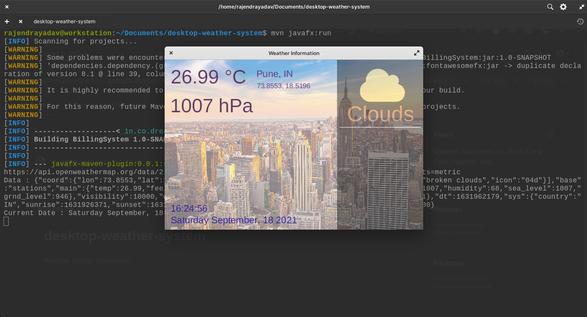

### ⛅ Weather Application for Desktop using JavaFX , OpenWeatherMap

---

📚 Learning & ⛅ Making must be togather.

---

- Fork it, Make search feature in it.
- Currently, City 🌇 and unit 🎚️ is a hard-coded unit. Make it possible to choice using dropdown.
- I'm not master in JavaFX, Also, I don't have time ⏲️ to work on it.

- Setup and Enviornment variable named WEATHER_MAP_API_KEY in you system 🖥️.
  ```bash
  $ vim ~/.bashrc
  ```

```bash
...
WEATHER_MAP_API_KEY="7a3ca83c6afce91aaxxxxxxxxxxxxxxx";
    <ESC> :wq <RETURN>
```

- Once API is setup, Run the application using following command

```bash
    mvn clean javafx:run
```

- After running app, output will be something like



- Application is not responsive. Need finishing work.

---

Thanks for your visit...
Happy Coding 👍 ❤️ 🇮🇳
